Nell’immaginario collettivo, quando si pensa a un duello, vengono alla mente scene in cui due contendenti si sfidano per l’amore di una donna o per difendere l’onore di una casata. Essenzialmente duelli all’arma bianca, a meno che non si faccia riferimento al Far West con i suoi pistoleri dalla mano lesta. Eppure, esiste un tipo di scontro altrettanto brutale e decisivo che non si combatteva nelle radure all’alba, ma nelle piazze affollate e nelle corti reali, armati solo di carta, inchiostro e ingegno: il duello matematico.

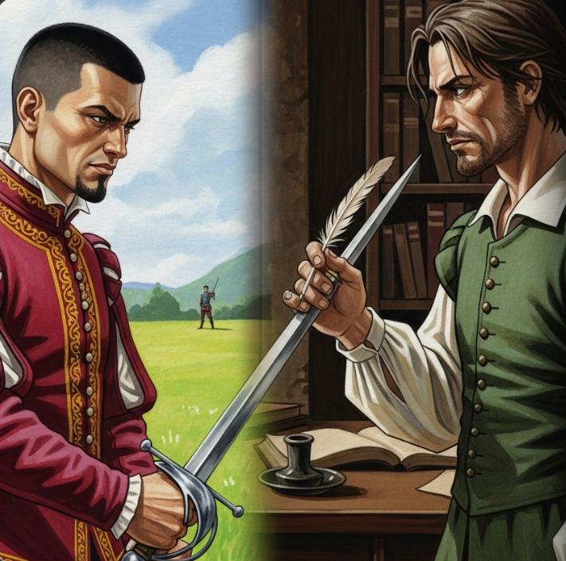

Nel sedicesimo secolo, la matematica non era solo una materia scolastica, ma uno sport estremo. Risolvere un’equazione che nessuno era mai riuscito a domare significava ottenere prestigio, denaro e cattedre universitarie. I matematici si lanciavano sfide pubbliche, proponendo problemi quasi impossibili. Perdere significava l'umiliazione; vincere significava diventare una leggenda. In questo clima di segreti, la sfida suprema riguardava le equazioni di terzo grado, dove l'incognita appare elevata alla terza potenza.

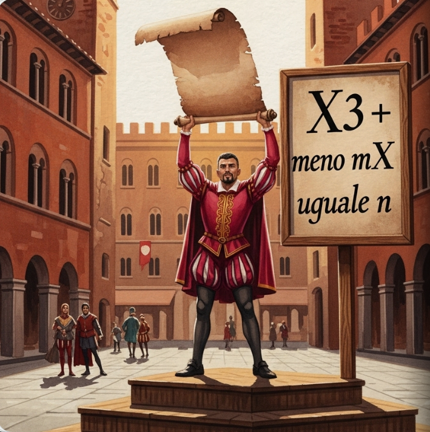

Il primo a trovare una chiave per queste equazioni portò il segreto con sé quasi fino alla tomba, rivelandolo solo a un suo allievo. Quel segreto era un’arma magica, una formula capace di sbloccare i misteri del cubo. Ma Niccolò, un uomo che aveva superato mille difficoltà e che tutti chiamavano "lo scultore dei numeri", non era tipo da arrendersi. Egli passò notti insonni a cercare di riscoprire quella formula perduta, convinto che la logica potesse abbattere ogni muro di silenzio.

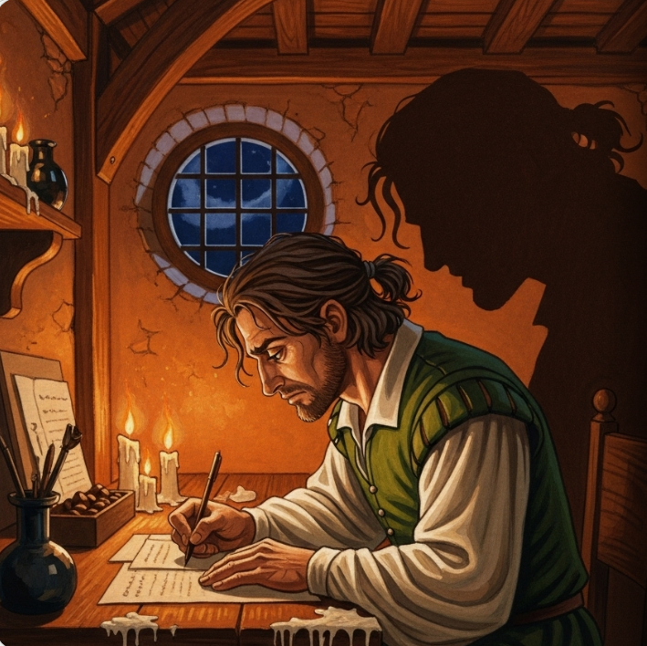

La notte prima del grande duello contro l'allievo che deteneva il segreto, Niccolò ebbe un'intuizione fulminante. Trovò la regola generale per risolvere le equazioni dove il cubo e l'incognita convivono. Quando arrivò il giorno della sfida, Niccolò non si limitò a rispondere ai problemi; annichilì l'avversario. In meno di due ore risolse trenta problemi complessi. Il suo giovane assistente, Algor, non poteva credere ai propri occhi: Niccolò era diventato il nuovo re dell'algebra.

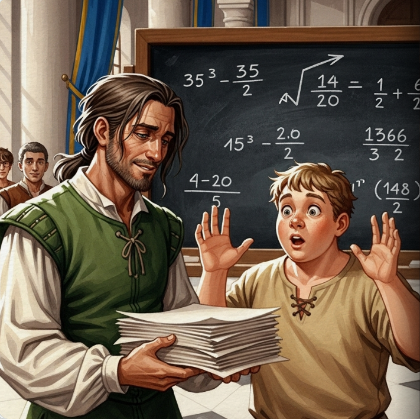

Entra in scena Ludovico, un medico e matematico brillante ma estremamente ambizioso. Ludovico voleva quella formula a ogni costo per il suo grande libro sull'algebra. Niccolò, inizialmente restio, accettò di rivelargli il segreto, ma solo sotto un giuramento solenne: Ludovico non avrebbe mai dovuto pubblicarla. Era un patto di onore tra gentiluomini. Ma nel mondo delle scoperte, dove la gloria eterna è in palio, l'ambizione spesso pesa più della parola data.

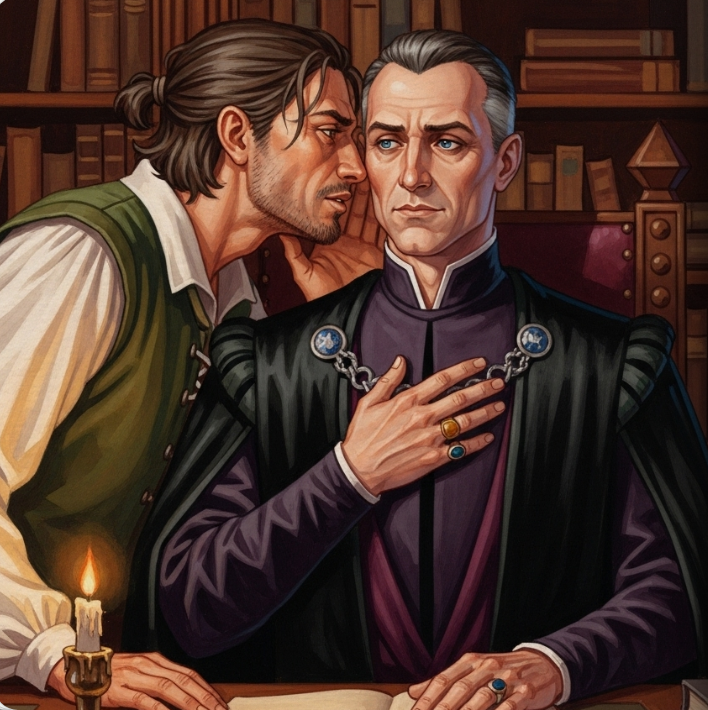

Ludovico, indagando tra vecchie carte impolverate, scoprì che altri avevano sfiorato la soluzione prima di Niccolò. Usò questa scusa come scappatoia morale per infrangere il giuramento. Pubblicò la formula nel suo capolavoro, "Ars Magna", rendendola di dominio pubblico. Ludovico ottenne la fama mondiale, ma al prezzo di un tradimento che non sarebbe mai stato dimenticato. Il libro divenne il testo sacro dell'algebra, ma portava con sé l'ombra di un patto infranto.

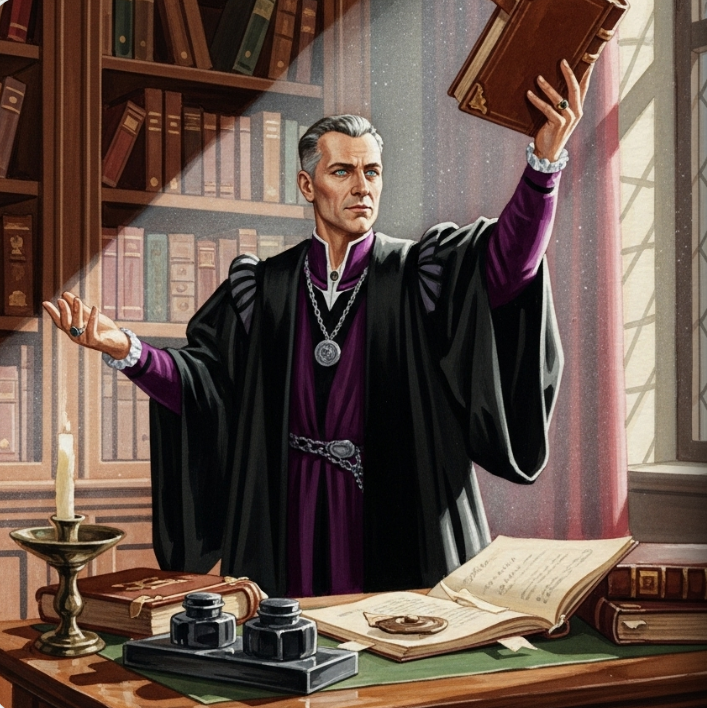

Niccolò, furibondo, sentì il suo onore calpestato. Iniziò così una guerra di libelli, insulti e lettere rabbiose che durò anni. I due matematici si scambiavano accuse feroci davanti a tutta Europa, trasformando la scienza in un campo di battaglia personale. Lo scontro culminò in una disputa pubblica dove Ludovico mandò il suo miglior allievo a combattere al suo posto. Il rancore tra i due non si placò mai, lasciando una cicatrice profonda nella storia della matematica.

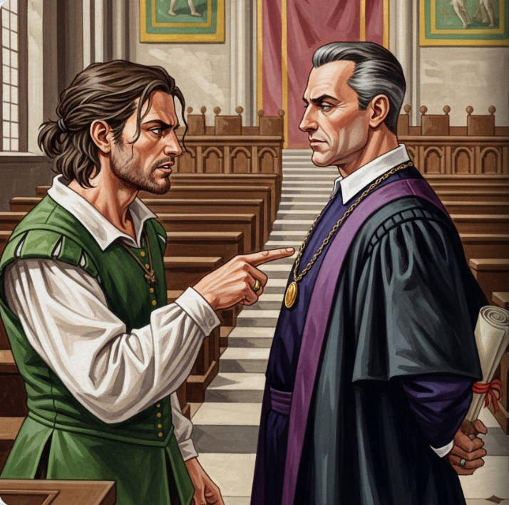

Ma la storia non si fermò al terzo grado. Ludovico aveva un allievo prodigio di nome Vico, che riuscì a fare l'impossibile: trovare la formula per le equazioni di quarto grado. Sembrava che la mente umana non avesse limiti e che ogni mistero potesse essere racchiuso in una formula elegante. Vico e Ludovico celebrarono il successo, convinti che presto avrebbero conquistato anche il quinto grado, la vetta più alta e pericolosa della montagna algebrica.

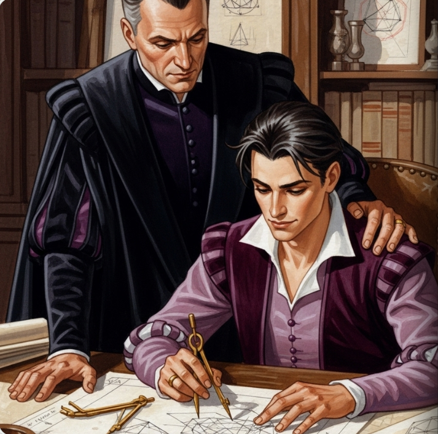

I decenni diventarono secoli, e il quinto grado rimase un muro invalicabile. Molti geni si schiantarono contro di esso finché non apparve Paolo, un medico italiano che amava i numeri quanto la medicina. Paolo non cercava solo la formula; iniziò a sospettare qualcosa di scioccante per l'epoca. E se la formula per il quinto grado semplicemente non esistesse? Paolo dedicò la vita a cercare di dimostrare questa impossibilità, curando i malati di giorno e sfidando l'infinito di notte.

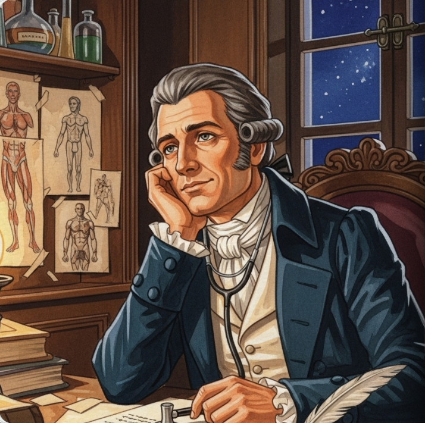

Paolo scrisse un trattato monumentale, convinto di aver finalmente dimostrato che le equazioni di quinto grado non potevano essere risolte con i metodi classici. Ma la comunità scientifica era scettica. Un matematico anziano di nome Giano derise il suo lavoro, sostenendo che Paolo non era abbastanza rigoroso. Paolo morì senza vedere la sua scoperta riconosciuta, vittima dell'arroganza di chi non voleva accettare che esistessero limiti invalicabili alla potenza delle formule.

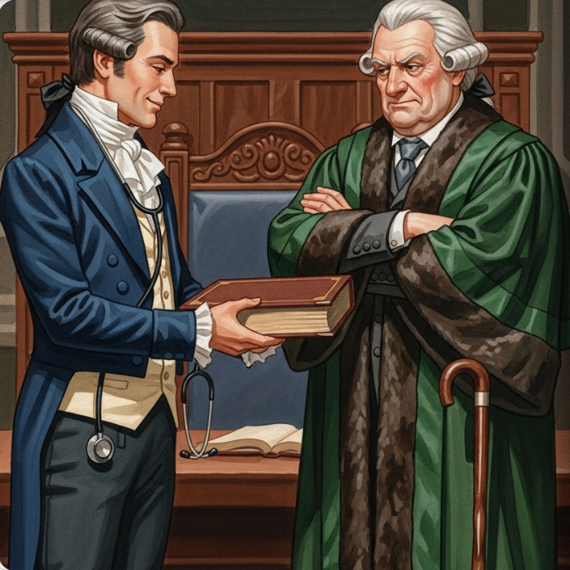

Il testimone passò a Niels, un giovane norvegese che viveva in povertà ma con una mente brillante come il ghiaccio del nord. Niels non conosceva il lavoro di Paolo, ma arrivò alla stessa conclusione con una precisione chirurgica. Egli dimostrò definitivamente che il quinto grado era una fortezza chiusa dall'interno. Viaggiò per l'Europa cercando riconoscimento, ma la sfortuna e la malattia lo perseguitarono, lasciandolo solo con i suoi pensieri rivoluzionari.

Niels morì giovanissimo, proprio pochi giorni prima che arrivasse la lettera che gli offriva finalmente un posto prestigioso. La sua dimostrazione, che oggi porta anche il nome di Paolo, segnò la fine di un'era. Il sogno di trovare una formula per ogni cosa era svanito, ma dalle ceneri di quel sogno stava per nascere qualcosa di ancora più grande. Il duello non era più contro un'equazione specifica, ma per capire la natura stessa della simmetria.

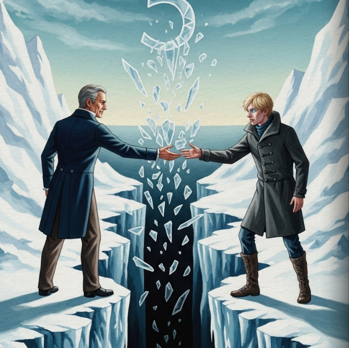

Mentre il mondo cambiava, un giovane ribelle di nome Evariste stava per rivoluzionare tutto. Evariste non combatteva solo con la penna; era un fervente rivoluzionario che sognava la libertà per il suo popolo. Vedeva strutture invisibili, che chiamava "gruppi", dove gli altri vedevano solo calcoli noiosi. La sua visione era così avanti rispetto ai tempi che nessuno riusciva a capirlo, portandolo a uno scontro continuo con le autorità accademiche e politiche.

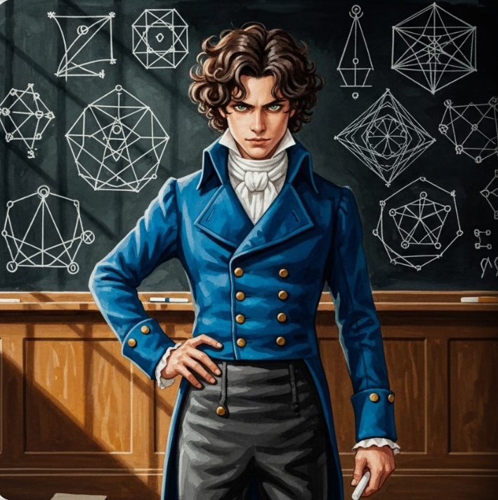

La vita di Evariste fu breve e fiammeggiante. La notte prima di un duello d'onore che sapeva sarebbe stato fatale, scrisse freneticamente una lettera a un amico. In quelle pagine tracciò le basi della matematica moderna, spiegando perché alcune equazioni sono risolvibili e altre no basandosi sulla loro simmetria interiore. Sapeva che il tempo stava per scadere e che la sua unica speranza di immortalità risiedeva in quei fogli macchiati d'inchiostro.

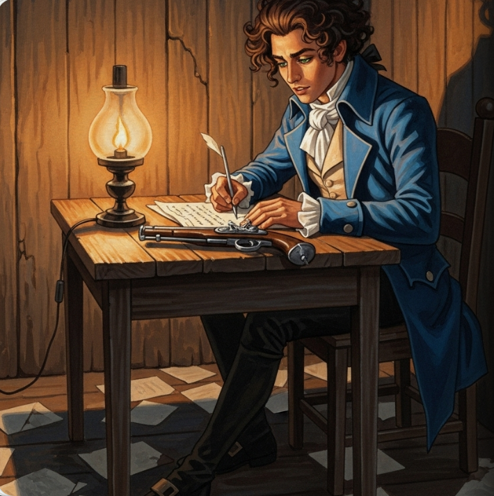

La storia dell'algebra è un'epopea di geni, tradimenti e sacrifici. Da Niccolò a Evariste, passando per il coraggio di Paolo e Niels, la ricerca della verità è stata una battaglia per l'immortalità dell'intelletto. Oggi, quando risolviamo un enigma, onoriamo questi uomini che hanno guardato l'impossibile negli occhi senza mai abbassare lo sguardo. Perché il vero potere non risiede in una formula magica, ma nella libertà di esplorare l'ignoto.

